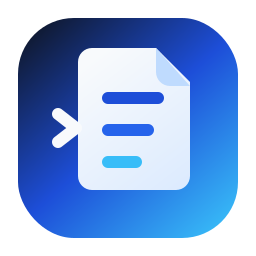
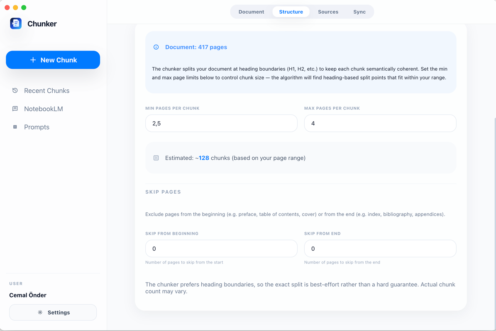
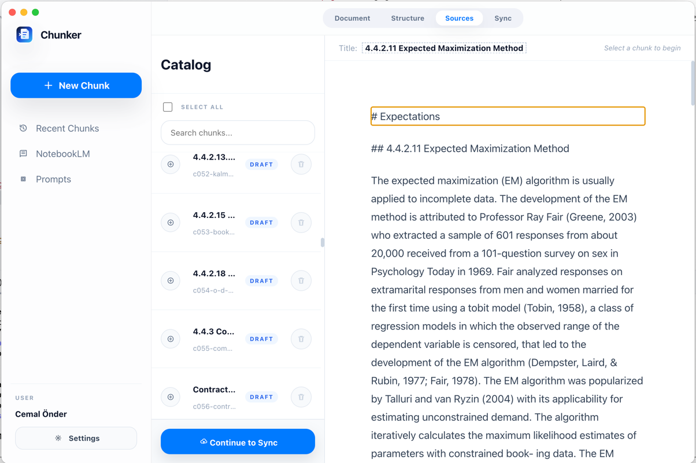
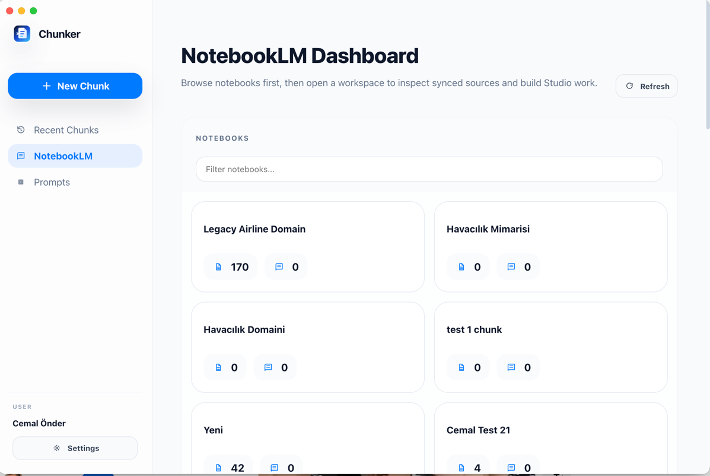
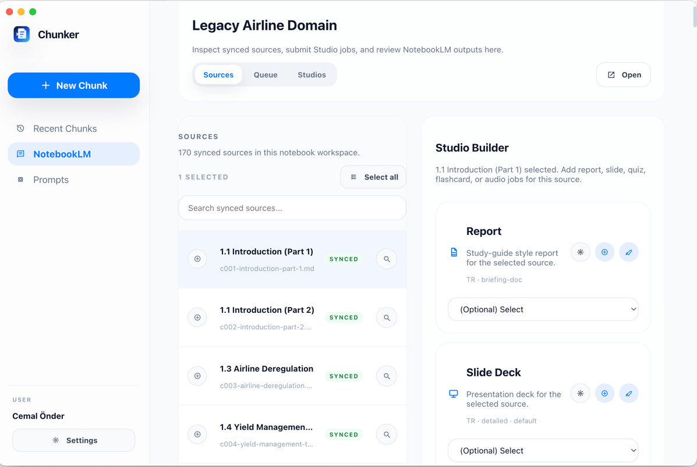
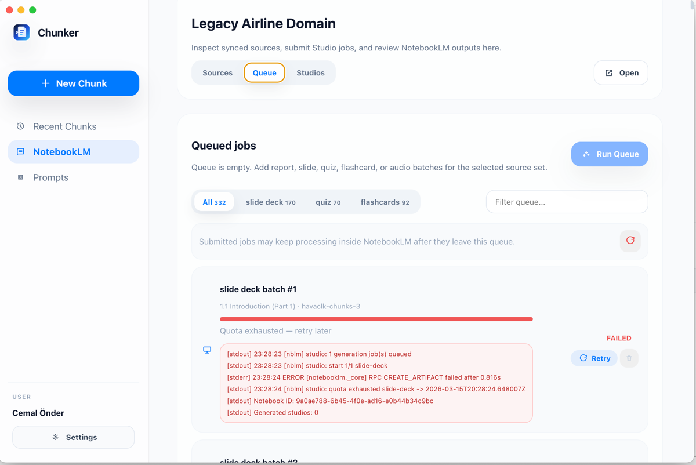
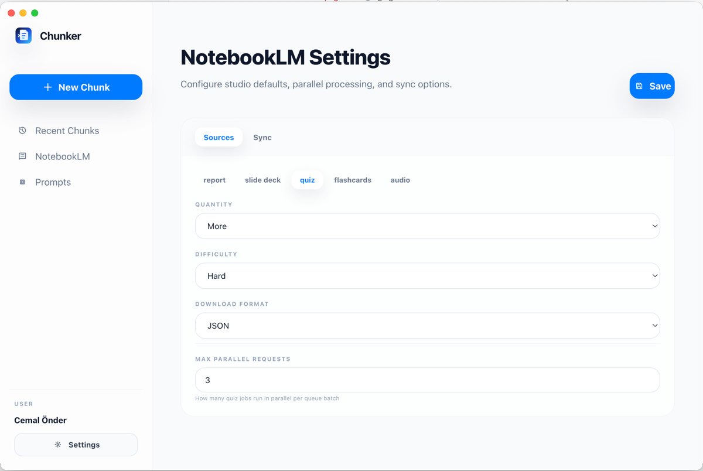

<p align="center">
  
</p>

<h1 align="center">notebooklm-chunker</h1>

<p align="center">
  <a href="https://github.com/cmlonder/notebooklm-chunker/actions/workflows/ci.yml"></a>
  <a href="https://github.com/cmlonder/notebooklm-chunker/actions/workflows/desktop-release.yml"></a>
  <a href="https://badge.fury.io/py/notebooklm-chunker"></a>
  <a href="https://opensource.org/licenses/MIT"></a>
</p>

<p align="center">Turn long documents into smaller, heading-aware NotebookLM sources so reports, slide decks, quizzes, flashcards, and audio outputs stay more focused and useful.</p>

> **Two interfaces, one core.** The Desktop app provides a visual workflow. The CLI provides scriptable automation. Both use the same `nblm` engine underneath.
>
> - **This page** covers the Desktop app
> - **[CLI.md](CLI.md)** covers the Python CLI

---

## Desktop App

An Electron desktop client that wraps the `nblm` CLI into a full visual workflow — from PDF upload to NotebookLM Studio generation.

### Partition Strategy

Set min and max pages per chunk, skip pages from the beginning (preface, TOC) or end (index, bibliography), and see the estimated chunk count before processing. The chunker splits at heading boundaries to keep each source semantically coherent.



### Sources

Review, search, and edit generated chunks inline. Bulk select and delete, or refine titles and content before syncing.



### NotebookLM Dashboard

Browse all your NotebookLM notebooks in one place. Open a workspace to see synced sources, manage studio jobs, and track outputs.



### Notebook Workspace

Inspect synced sources for any notebook. Select sources individually or in bulk to build studio queue batches.



### Studio Queue

Queue reports, slides, quizzes, flashcards, or audio jobs across sources. Filter by studio type, search by name or status. Retry failed jobs individually or in bulk — quota exhaustion is automatically detected.



### Settings

Configure per-studio defaults: language (80+ languages), format, download format, and parallel request limits. Sync settings control parallel chunk uploads.



### More Features

| Feature | Description |
|---|---|
| **Bulk source upload** | Upload dozens or hundreds of chunks to a single notebook in one operation with parallel processing |
| **Bulk source delete** | Select and delete multiple chunks at once from the catalog |
| **Resume interrupted uploads** | Sync tracks per-chunk status — come back tomorrow and only the remaining chunks get uploaded |
| **Prompt library** | Save reusable prompts per studio type and apply them from the queue builder |
| **Skip pages** | Exclude preface, table of contents, index, or bibliography pages before chunking |
| **Versioned lineages** | Multiple chunk versions of the same PDF, each with independent sync and studio state |
| **Offline-first** | Chunk and edit locally without a network connection — sync when ready |

---

### Installation

#### Prerequisites

1. Install the Python CLI (needed by the desktop app):

```bash
pip install notebooklm-chunker
python -m playwright install chromium
```

2. Login to NotebookLM:

```bash
nblm login
```

#### Option A: Download Release Binary

Download the latest release for your platform from [GitHub Releases](https://github.com/cmlonder/notebooklm-chunker/releases):

- **macOS**: `.dmg` or `.zip`
- **Windows**: `.exe` (installer) or portable
- **Linux**: `.AppImage` or `.deb`

The desktop app expects `nblm` to be available on your system PATH.

#### Option B: Run From Source

```bash
cd desktop
npm install
npm run dev
```

### Setup Check

On first launch, the app verifies:

- `nblm` is available on PATH
- Playwright Chromium is installed
- NotebookLM auth state is ready

You can continue into the app for local-only work even if auth is not ready yet.

### Build

Platform-specific builds:

```bash
cd desktop
npm run build:mac    # macOS (.dmg, .zip)
npm run build:win    # Windows (.exe, portable)
npm run build:linux  # Linux (.AppImage, .deb)
```

---

## CLI

The Python CLI is the automation engine. It handles document parsing, heading-aware chunking, NotebookLM uploads, and Studio generation.

For full CLI documentation, installation, config examples, and usage:

**[CLI.md](CLI.md)**

Quick start:

```bash
pip install notebooklm-chunker
python -m playwright install chromium
nblm login
nblm run --config ./nblm.toml
```

---

## Development

For setup, testing, packaging, and GitHub release flow, see [DEVELOPMENT.md](DEVELOPMENT.md).

## License

MIT
